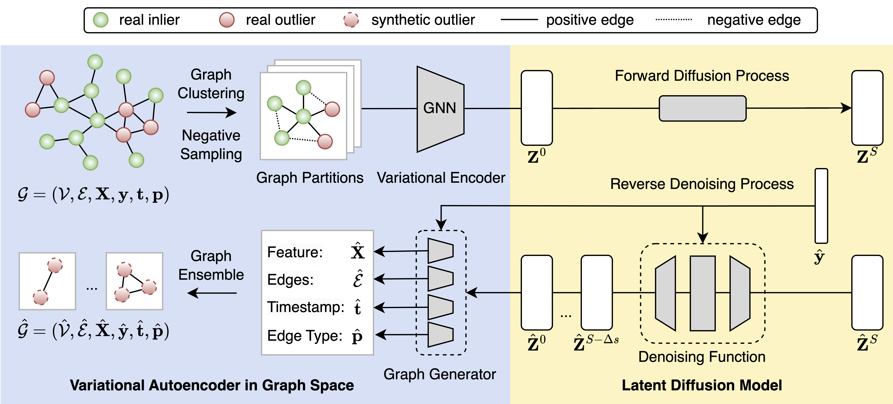

# GODM

[](https://badge.fury.io/py/godm)

GODM is a data augmentation package for supervised graph outlier detection. It generates synthetic graph outliers with latent diffusion models. This is the official implementation of [Data Augmentation for Supervised Graph Outlier Detection with Latent Diffusion Models](https://arxiv.org/abs/2312.17679).

<p align="center">

</p>

## Installation

It is recommended to use **pip** for installation:

```pip install godm```

Alternatively, you can build from source by cloning this repository:

```
git clone https://github.com/kayzliu/godm.git
cd pygod
pip install .
```

## Usage

```python
from pygod.utils import load_data
data = load_data('weibo') # load data

from godm import GODM     # import GODM
godm = GODM(lr=0.004)     # init. GODM
aug_data = godm(data)     # augment data

detector(aug_data)        # train on data
```

## Parameters

- ```hid_dim``` (type: `int`, default: `None`): hidden dimension for VAE, i.e., latent embedding dimension. `None` means the largest power of 2 that is less than or equal to the feature dimension divided by two.
- ```diff_dim``` (type: `int`, default: `None`): hidden dimension for denoiser. `None` means as twice as `hid_dim`.
- ```vae_epochs``` (type: `int`, default: `100`): number of epochs for training VAE.
- ```diff_epochs``` (type: `int`, default: `100`): number of epochs for training diffusion model.
- ```patience``` (type: `int`, default: `50`): patience for early stopping.
- ```lr``` (type: `float`, default: `0.001`): learning rate.
- ```wd``` (type: `float`, default: `0.`): weight decay.
- ```batch_size``` (type: `int`, default: `2048`): batch size.
- ```threshold``` (type: `float`, default: `0.75`): threshold for edge generation.
- ```wx``` (type: `float`, default: `1.`): weight for node feature reconstruction loss.
- ```we``` (type: `float`, default: `0.5`): weight for edge reconstruction loss.
- ```beta``` (type: `float`, default: `0.001`): weight for KL divergence loss.
- ```wt``` (type: `float`, default: `1.`): weight for time prediction loss.
- ```time_attr``` (type: `str`, default: `edge_time`): attribute name for edge time.
- ```type_attr``` (type: `str`, default: `edge_type`): attribute name for edge type.
- ```wp``` (type: `float`, default: `0.3`): weight for node prediction loss.
- ```gen_nodes``` (type: `int`, default: `None`): number of nodes to generate. `None` means the same as the number of outliers in the original graph.
- ```sample_steps``` (type: `int`, default: `50`): number of steps for diffusion model sampling.
- ```device``` (type: `int`, default: `0`): GPU index, set to -1 for CPU.
- ```verbose``` (type: `bool`, default: `False`): verbose mode.

## Cite Us:

Our [paper](https://arxiv.org/abs/2312.17679) is publicly available. If you use GODM in a scientific publication, we would appreciate your citations:

    @article{liu2023data,
      title={Data Augmentation for Supervised Graph Outlier Detection with Latent Diffusion Models},
      author={Liu, Kay and Zhang, Hengrui and Hu, Ziqing and Wang, Fangxin and Yu, Philip S.},
      journal={arXiv preprint arXiv:2312.17679},
      year={2023}
    }

or:

    Liu, K., Zhang, H., Hu, Z., Wang, F., and Yu, P.S. 2023. Data Augmentation for Supervised Graph Outlier Detection with Latent Diffusion Models. arXiv preprint arXiv:2312.17679.
    
## 
